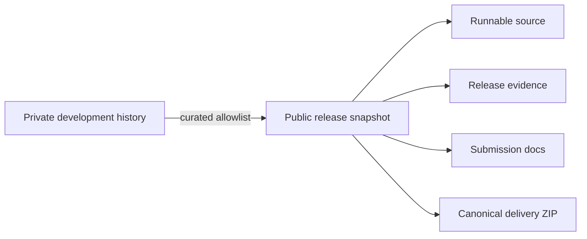

# 🔒 Public Snapshot Boundary

> **Status:** Public release-minimal snapshot 
> **Repository:** [`CAPTW/PPTXGenerator`](https://github.com/CAPTW/PPTXGenerator) 
> **Default branch:** [`main`](https://github.com/CAPTW/PPTXGenerator/tree/main) 
> **History policy:** curated snapshot plus bounded public-safe corrective commits

---

## Why this repository is a snapshot

This repository is intentionally published as a **release-minimal snapshot** of
PPTX Generator. It began from one curated snapshot and later received only
bounded public-safe corrective commits. It contains the materials needed to
review, run, and verify the DevPost candidate without exposing the full
experimental development history or machine-local research surface.

---

## ✅ Included

| Category | Included public surface |
|---|---|
| Product | source, configuration, schemas, and release-focused tests |
| Demo | one prompt, two searchable PDF fixtures, and the canonical configuration |
| Documentation | runbooks, architecture, limitations, submission materials, and public boundaries |
| Evidence | final gate, reproducibility reports, package validation, and canonical delivery ZIP |
| External integration | path-neutral Skill fingerprint pin and standard-library installer |
| Legal | Apache License 2.0 and third-party notices |

## 🚫 Deliberately omitted

| Omitted surface | Reason |
|---|---|
| Pre-snapshot Git history | avoid publishing unrelated experimental and machine-local history |
| Machine-local paths and authentication material | privacy and publication hygiene |
| External `CAPTW/pngtopptx` Skill source | fetched into an external Skill root during setup; not vendored or redistributed |
| Python virtual environments and Node modules | reproducible installation is defined by locks and manifests |
| Browser, font, PowerPoint, and Tesseract/Cairo binaries | prepared-machine software; not project artifacts |
| Unrelated analysis, audit, and development assets | outside the reviewed publication allowlist |
| Nine release-authority tests requiring omitted Git history or machine-local paths | cannot run honestly in the minimal public snapshot |

---

## 🔗 External prerequisites

The public snapshot remains runnable under the documented prepared-machine
profile. The setup wrapper can fetch and verify the pinned external SkillSet,
but this repository does **not** redistribute:

- Microsoft PowerPoint;
- Chrome for Testing / Playwright browser binaries;
- external `CAPTW/pngtopptx` Skills;
- Node dependency directories;
- Python package wheels;
- Cairo / Tesseract installation files.

The first automatic Skill installation requires network access. Once installed
and verified, the canonical demo itself consumes the frozen visual bundle and
does not require a live Image Generation call or API key.

See the [runtime guide](docs/devpost/PHASE_07_DEPENDENCY_AND_RUNTIME_GUIDE.md) and [third-party notices](THIRD_PARTY_NOTICES.md).

---

## ⚖️ License scope

Files in this published snapshot are provided under the [Apache License 2.0](LICENSE), unless a file or third-party notice states otherwise.

This repository license:

- applies to project-authored material in this published snapshot;
- does not grant rights to omitted material;
- does not replace the terms governing external software, dependencies, services, or generated/reference assets;
- does not imply acceptance of third-party terms on behalf of any user or system.

---

## 📌 Publication state

| Action | State |
|---|---|
| Public repository created | ✅ Complete |
| `main` pushed | ✅ Complete |
| Tag created | ⏳ Not performed |
| GitHub Release created | ⏳ Not performed |
| DevPost submitted | ⏳ Not performed |
