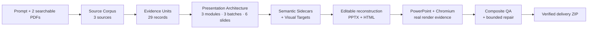

<div align="center">

# 🧭 PPTX Generator

**An evidence-linked presentation compiler for editable PowerPoint and HTML decks**

[](LICENSE)
[](requirements/devpost-release.lock.txt)
[](docs/devpost/submission/KNOWN_LIMITATIONS.md)
[](docs/devpost/evidence/phase7_final/final_release_gate.json)
[](docs/devpost/submission/DEVPOST_FORM_PAYLOAD.md)

<br/>

> **PPTX Generator turns one prompt and local source documents into an evidence-linked, creatively planned, editable PowerPoint deck and companion HTML presentation—with deterministic QA, real rendering, and bounded upstream repair.**

[General workflow](docs/GENERAL_GENERATE_WORKFLOW.md) · [Quick start](#-quick-start) · [Architecture](#-how-it-works) · [Evidence](#-verified-release-evidence) · [Documentation](docs/README.md) · [Limitations](docs/devpost/submission/KNOWN_LIMITATIONS.md)

</div>

---

## ✨ At a glance

| Input | Architecture | Editable output | Verification |
|---|---|---|---|
| 1 prompt + 2 searchable PDFs | 3 sources · 29 Evidence Units · 3 modules · 6 slides | PPTX + HTML · 131 text objects · 1 native table | 36/36 stages · 6/6 renders · 6/6 captures · 81/81 final gates |

<table>
<tr>
<td width="25%"><b>📚 Evidence-first</b><br/>Every factual claim is bound to recorded source evidence.</td>
<td width="25%"><b>🎨 Content-aware design</b><br/>Module–Batch–Slide planning and Creative Template Architecture shape the deck.</td>
<td width="25%"><b>✏️ Actually editable</b><br/>Text and tables remain native PowerPoint and HTML objects.</td>
<td width="25%"><b>🧪 Fail-closed</b><br/>Dependency, render, semantic, editability, parity, package, and repair gates must all pass.</td>
</tr>
</table>

---

## 🧩 How it works



### Semantic and visual authority

| Layer | Authority |
|---|---|
| Evidence Units | factual source authority |
| Semantic Sidecars | canonical text, data, editability, and evidence bindings |
| Visual Targets | composition and visual direction |
| PPTX + HTML | derived editable outputs |
| Renders + screenshots | objective inspection surfaces |
| Composite QA | integrated release verdict |

> Generated visual references guide composition; they are **not** used as full-slide screenshots or canonical text.

---

## 🚀 Quick start

### Prepared-machine profile

- Windows x64
- CPython 3.11.9 AMD64
- Microsoft PowerPoint 16.0 COM
- Playwright 1.61.0 + Chrome for Testing 149.0.7827.55
- Node.js 24.13.1 + npm 11.11.0
- network access for the first verified `CAPTW/pngtopptx` installation

### Start a general prompt/PDF workflow

```powershell
python -m pip install -e .

deckcompiler generate `
  --output-dir <new-empty-output-directory-outside-repo> `
  --prompt "Create the best presentation for these materials." `
  --pdf <first.pdf> `
  --pdf <second.pdf> `
  --workflow auto
```

The entrypoint copies and fingerprints the inputs, writes a hash-bound resumable
manifest plus `skillset_execution_plan.json`, scaffolds an isolated
`pngtopptx-project`, and exits with code `2` at
`AWAITING_WORKFLOW_ARCHITECT`. The first production Skill is always
the repository-owned `.agents/skills/pptx-workflow-architect`, regardless of
prompt wording or input channel.
After approved Gates 1 and 2, the repo-owned Codex workflow calls
`image_gen.imagegen` for every approved slide. The default explicit
`terra-max` is the quality-first default proven by the accepted reconstruction;
`sol-medium` and `luna-max` remain explicit alternatives under the same locked blueprint,
prompts, Semantic Sidecars, renderer, vector policy, compiler, and QA. Luna may
fall back to Sol only for a failed slide after a named blocking gate. Either
profile dispatches up to 20 independent built-in calls concurrently, then runs one
hash-bound `PPTXlocal/raw` measurement/bounded-vector preflight and one fresh,
isolated reconstruction context immediately for each accepted source slide
while unfinished ImageGen calls continue (at most six workers
concurrently). It validates and integrates those fragments with the official
PNGtoPPTX scripts, uses one shared all-slide preview for source-mapped per-slide
QA, and runs one final all-slide reconstruction render and gate. It enters
targeted repair only when the
external gate or the repository high-fidelity issue policy finds a real defect.
Fresh reconstruction workers use the profile's `minimal_locked` Codex context:
ephemeral execution, no global user/rule context, and plugins, apps, memories,
multi-agent, and ImageGen disabled. Each sealed one-slide job supplies its one
required renderer Skill path explicitly, avoiding repeated full Skill catalogs.
Concurrent dispatch is requested, while actual provider intervals and observed
parallelism are recorded. If the platform queues the wave, reconstruction still
streams behind each completed image instead of waiting for all 20.

For a hash-verified one-slide reconstruction, the promoted fast lane keeps the
full render and QA chain while reusing sealed measurement/authoring/capture
inputs. The measured runs were 42.224 seconds with a cold HTML capture and
11.762 seconds on an exact-input capture hit, with zero metric drift. A
first-time arbitrary-image authoring miss remains on the full `terra-max` lane;
the repository does not claim a two-minute bound for that case.

The live fast-path baseline is canonical `CAPTW/pngtopptx` commit `2b6120d`.
Its exact four-Skill tree OIDs and combined aggregate are recorded in the
workflow dependency contract, while each generated run binds the installed
entrypoint hashes. The separately certified DevPost demo keeps its older
release pin unchanged as historical evidence.

`generate` fails closed before intake when any tracked Architect package file,
required ImageGen/PNGtoPPTX Skill, or official script is absent. The execution
plan binds the four repository Architect files plus installed companion Skill
and entrypoint hashes and spells out the tested companion path:
conditional text-layer preprocessing, project-local Node dependencies, explicit
crop plan/manifest, `slide-image-dual-render` reconstruction hardlocks,
measured-coordinate and bounded non-text SVG gates, hash-bound per-slide worker
receipts, integrator-owned `lib/slides.js`,
source-mapped PPTX/HTML visual QA, zero isolated per-slide builds, two shared
full-deck render passes, repair waves of at most five slides only for defects,
and the final openability gate. The profile
records a 120-to-30-minute target for 20 slides (approximately 4x) without
weakening the quality gates. Use `--skill-root <path>` only when the verified
ImageGen/PNGtoPPTX companions are not under `CODEX_HOME\skills` or
`USERPROFILE\.codex\skills`; it never overrides the repository Architect.

See the [general workflow runbook](docs/GENERAL_GENERATE_WORKFLOW.md) for the
Skill order, approval gates, run sealing, and completion contract.

### Run the canonical demo

```powershell
python -m venv <venv-outside-clone>
<venv-outside-clone>\Scripts\python.exe -m pip install `
  --require-hashes `
  -r requirements/devpost-release.lock.txt

powershell -ExecutionPolicy Bypass -File scripts\run_demo.ps1 `
  -Python <venv-outside-clone>\Scripts\python.exe `
  -OutputDir <new-empty-output-directory-outside-repo>
```

`run_demo.ps1` installs the release-pinned four-SkillSet from
[`CAPTW/pngtopptx`](https://github.com/CAPTW/pngtopptx) when it is missing,
verifies the exact upstream commit, subtree OIDs, and file hashes, and then runs
the demo. An existing mismatched installation fails closed unless an explicit
documented backup-and-replace migration is requested.

Expected result:

```text
DECKCOMPILER_DEMO_GO
VERDICT=ELIGIBLE_FOR_FRESH_CLONE_PROOF
```

See the [demo runbook](docs/devpost/PHASE_07_DEMO_RUNBOOK.md) and [runtime guide](docs/devpost/PHASE_07_DEPENDENCY_AND_RUNTIME_GUIDE.md).

---

## ✅ Verified release evidence

| Proof | Result |
|---|---:|
| Public demo stages | 36 / 36 PASS |
| PowerPoint renders | 6 / 6 |
| Chromium captures | 6 / 6 |
| Editable text objects | 131 |
| Native tables | 1 |
| Picture objects | 0 |
| Full-slide raster violations | 0 |
| Historical Phase 7 full-workspace focused tests | 274 PASS |
| Historical Phase 7 full-workspace suite | 733 PASS |
| Current public minimal-snapshot suite | 501 PASS |
| Final release prerequisites | 81 / 81 PASS |
| Canonical / repeat / fresh unexplained divergence | 0 |

**Final technical status:** `ELIGIBLE_FOR_DEVPOST_SUBMISSION`

> The 274/733 rows are immutable historical Phase 7 evidence. The test
> inventory published in this release-minimal repository is the separately
> verified 501-test suite, including the general generate workflow and runtime
> Phase 6 authority path.

- [Final release gate](docs/devpost/evidence/phase7_final/final_release_gate.json)
- [Canonical delivery ZIP](docs/devpost/evidence/phase7_final/pptx_generator_devpost_delivery.zip)
- [Technical metrics](docs/devpost/submission/TECHNICAL_METRICS.md)
- [Screenshot and artifact index](docs/devpost/submission/SCREENSHOT_AND_ARTIFACT_INDEX.md)

---

## 🖼️ Image Generation boundary

The general workflow has two explicit execution surfaces:

- Repository Python captures inputs, emits the mandatory Architect-first Codex
  dispatch, deterministically derives all slide requests from the approved
  Blueprint and Design System without another model call, seals execution
  evidence, and validates completion. It does not pretend to invoke a platform
  tool.
- The live Codex Skill calls `image_gen.imagegen`, inspects and regenerates
  slide images in concurrent waves of up to 20, runs the installed PNGtoPPTX
  SkillSet once across the accepted deck, and executes visual-QA repair waves
  only for named blockers.

The separate reproducible release demo still validates and consumes its frozen
visual bundle without rerunning Image Generation. Generated slide PNGs are
reconstruction references; the delivered semantic surface remains editable
PowerPoint objects.

---

## 🗂️ Documentation map

| Start here | Build and run | Understand the system | Verify the release | Submit / publish |
|---|---|---|---|---|
| [Documentation hub](docs/README.md) | [Demo runbook](docs/devpost/PHASE_07_DEMO_RUNBOOK.md) | [Architecture overview](docs/devpost/submission/ARCHITECTURE_OVERVIEW.md) | [Technical metrics](docs/devpost/submission/TECHNICAL_METRICS.md) | [DevPost form payload](docs/devpost/submission/DEVPOST_FORM_PAYLOAD.md) |
| [Project summary](docs/devpost/submission/PROJECT_SUMMARY.md) | [Dependency guide](docs/devpost/PHASE_07_DEPENDENCY_AND_RUNTIME_GUIDE.md) | [Existing / adapted / new](docs/devpost/submission/EXISTING_ADAPTED_NEW.md) | [Final gate](docs/devpost/evidence/phase7_final/final_release_gate.json) | [Human review checklist](docs/devpost/submission/FINAL_HUMAN_REVIEW_CHECKLIST.md) |
| [Public snapshot boundary](PUBLICATION_BOUNDARY.md) | [Known limitations](docs/devpost/submission/KNOWN_LIMITATIONS.md) | [Judging evidence](docs/devpost/submission/JUDGING_EVIDENCE_MATRIX.md) | [Canonical ZIP](docs/devpost/evidence/phase7_final/pptx_generator_devpost_delivery.zip) | [Submission checklist](docs/devpost/submission/SUBMISSION_CHECKLIST.md) |

---

## ⚖️ Existing, adapted, and new

- **Build Week new:** evidence contracts, multi-source intake, Presentation Architecture integration, Semantic Sidecars, visual-bundle orchestration, Composite QA, controlled repair, dependency closure, one-command demo, packaging, and fresh-clone proof.
- **Adapted existing:** source ingestion, workflow planning, creative-planning surfaces, editable-template concepts, QA concepts, and local runtime utilities.
- **External existing:** the pinned `CAPTW/pngtopptx` four-SkillSet and third-party runtime dependencies.

The external SkillSet was not created during Build Week and is not vendored into this repository.

---

## ⚠️ Scope limits

- The certified proof covers one source-controlled six-slide demo.
- Canonical certified input is one prompt plus exactly two text-searchable PDFs.
- The general live Codex workflow accepts an inline/file prompt plus zero to 50
  local PDFs and lets the approved Architect blueprint choose 1–400 slides. It
  is runtime-validated but is not part of the immutable canonical demo proof.
- PDF extraction/OCR capability depends on the active Codex document tooling;
  the intake command itself preserves PDF bytes without silently omitting them.
- Windows x64 is the certified profile.
- PowerPoint, Chromium, Node.js, Cairo/Tesseract, and the locked Python runtime are prepared-machine prerequisites.
- The external Skills are verified and installed automatically on first setup; their source is not vendored here.
- No perfect pixel parity, unbounded-volume ingestion, or arbitrary
  cross-platform PowerPoint claim is made. Live completion requires zero
  fail/blocking visual-QA slides, while remaining `needs_polish` findings are
  reported.

See [Known Limitations](docs/devpost/submission/KNOWN_LIMITATIONS.md).

---

## 📦 Publication status

| Item | Status |
|---|---|
| GitHub repository | **Published** — [`CAPTW/PPTXGenerator`](https://github.com/CAPTW/PPTXGenerator) |
| Default branch | `main` |
| Public history | [Current `main` history](https://github.com/CAPTW/PPTXGenerator/commits/main) |
| License | Apache License 2.0 |
| Git tag | Not created |
| GitHub Release | Not created |
| DevPost submission | Not yet submitted |

This repository contains a **release-minimal public history**, not the full
development history. It began from one curated snapshot and contains only
bounded public-safe corrective commits. See
[PUBLICATION_BOUNDARY.md](PUBLICATION_BOUNDARY.md).

---

## 📄 License

Project-authored source and documentation in this public snapshot are provided under the [Apache License 2.0](LICENSE), unless a file or third-party notice states otherwise.

External Skills, dependencies, platform-generated references, and prepared-machine software remain subject to their respective terms. See [THIRD_PARTY_NOTICES.md](THIRD_PARTY_NOTICES.md).
