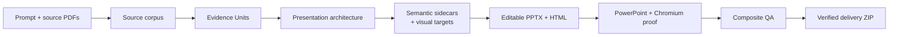

<!-- BRAND_REFRESH_2026_08_25 -->
<div align="center">

# 🧭 PPTX Generator

### Compile the evidence. Render the story. Verify the deck.

**An evidence-linked presentation compiler that turns a prompt and local source documents into creatively planned, editable PowerPoint and HTML — with real rendering, deterministic gates, and bounded repair.**


[Generate a deck](#quickstart) · [Architecture](#how-it-works) · [Verified proof](#verified-proof) · [Full technical reference](README.technical.2026-08-25.md)

</div>

---

> **A presentation is not verified because it looks convincing. It is verified when its claims, editable objects, renders, and delivery package agree.**

PPTX Generator treats presentation production as a compiler pipeline: source evidence becomes structured evidence units, architecture, semantic sidecars, visual targets, editable outputs, rendered inspection surfaces, and a fail-closed release verdict.

## What the compiler protects

| Layer | Contract |
|---|---|
| **Evidence** | Factual claims bind to recorded source evidence instead of free-floating generated prose. |
| **Architecture** | Module, batch, and slide planning happen before rendering. |
| **Editability** | Text and supported tables remain native in both PowerPoint and HTML. |
| **Verification** | PowerPoint renders, Chromium captures, semantic checks, parity checks, package checks, and bounded repair form one release gate. |

## How it works



Generated visual references guide composition. They are not accepted as canonical text or pasted as full-slide deliverables.

## Quickstart

```powershell
python -m pip install -e .

deckcompiler generate `
  --output-dir <new-empty-output-directory-outside-repo> `
  --prompt "Create the best presentation for these materials." `
  --pdf <first.pdf> `
  --pdf <second.pdf> `
  --workflow auto
```

The workflow is intentionally gated. It records exact inputs and dependencies, pauses at approval boundaries, reconstructs each slide through the approved Skill chain, and fails closed when required evidence or runtime components are absent.

## Verified proof

The retained canonical demonstration records:

| Proof | Result |
|---|---:|
| Public demo stages | 36 / 36 PASS |
| PowerPoint renders | 6 / 6 |
| Chromium captures | 6 / 6 |
| Editable text objects | 131 |
| Native tables | 1 |
| Final release gates | 81 / 81 PASS |

These figures describe the retained demo and its exact evidence package, not every future prompt, source document, or environment.

## Boundaries

- Windows x64 is the certified runtime profile for the retained release evidence.
- PowerPoint and Chromium are used as objective rendering surfaces.
- Missing Skill dependencies, mismatched pins, unverifiable inputs, or broken gates fail closed.
- Generated slides still require source-aware review; a green package does not turn weak source material into strong evidence.
- Performance targets are profile- and cache-dependent, not universal latency guarantees.

## Full technical reference

The original detailed README — including the complete generation contract, Skill routing, pinning model, cache fast path, font provenance, DevPost evidence, and release runbooks — is preserved unchanged at:

**[README.technical.2026-08-25.md](README.technical.2026-08-25.md)**

## License

Apache License 2.0. Source-document and generated-asset rights remain governed by their respective owners and inputs.
