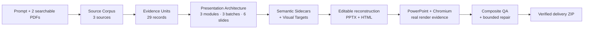

<div align="center">

# 🧭 PPTX Generator

**An evidence-linked presentation compiler for editable PowerPoint and HTML decks**

[](LICENSE)
[](requirements/devpost-release.lock.txt)
[](docs/devpost/submission/KNOWN_LIMITATIONS.md)
[](docs/devpost/evidence/phase7_final/final_release_gate.json)
[](docs/devpost/submission/DEVPOST_FORM_PAYLOAD.md)

<br/>

> **PPTX Generator turns one prompt and local source documents into an evidence-linked, creatively planned, editable PowerPoint deck and companion HTML presentation—with deterministic QA, real rendering, and bounded upstream repair.**

[Quick start](#-quick-start) · [Architecture](#-how-it-works) · [Evidence](#-verified-release-evidence) · [Documentation](docs/README.md) · [Limitations](docs/devpost/submission/KNOWN_LIMITATIONS.md)

</div>

---

## ✨ At a glance

| Input | Architecture | Editable output | Verification |
|---|---|---|---|
| 1 prompt + 2 searchable PDFs | 3 sources · 29 Evidence Units · 3 modules · 6 slides | PPTX + HTML · 131 text objects · 1 native table | 36/36 stages · 6/6 renders · 6/6 captures · 81/81 final gates |

<table>
<tr>
<td width="25%"><b>📚 Evidence-first</b><br/>Every factual claim is bound to recorded source evidence.</td>
<td width="25%"><b>🎨 Content-aware design</b><br/>Module–Batch–Slide planning and Creative Template Architecture shape the deck.</td>
<td width="25%"><b>✏️ Actually editable</b><br/>Text and tables remain native PowerPoint and HTML objects.</td>
<td width="25%"><b>🧪 Fail-closed</b><br/>Dependency, render, semantic, editability, parity, package, and repair gates must all pass.</td>
</tr>
</table>

---

## 🧩 How it works



### Semantic and visual authority

| Layer | Authority |
|---|---|
| Evidence Units | factual source authority |
| Semantic Sidecars | canonical text, data, editability, and evidence bindings |
| Visual Targets | composition and visual direction |
| PPTX + HTML | derived editable outputs |
| Renders + screenshots | objective inspection surfaces |
| Composite QA | integrated release verdict |

> Generated visual references guide composition; they are **not** used as full-slide screenshots or canonical text.

---

## 🚀 Quick start

### Prepared-machine profile

- Windows x64
- CPython 3.11.9 AMD64
- Microsoft PowerPoint 16.0 COM
- Playwright 1.61.0 + Chrome for Testing 149.0.7827.55
- Node.js 24.13.1 + npm 11.11.0
- network access for the first verified `CAPTW/pngtopptx` installation

### Run the canonical demo

```powershell
python -m venv <venv-outside-clone>
<venv-outside-clone>\Scripts\python.exe -m pip install `
  --require-hashes `
  -r requirements/devpost-release.lock.txt

powershell -ExecutionPolicy Bypass -File scripts\run_demo.ps1 `
  -Python <venv-outside-clone>\Scripts\python.exe `
  -OutputDir <new-empty-output-directory-outside-repo>
```

`run_demo.ps1` installs the release-pinned four-SkillSet from
[`CAPTW/pngtopptx`](https://github.com/CAPTW/pngtopptx) when it is missing,
verifies the exact upstream commit, subtree OIDs, and file hashes, and then runs
the demo. An existing mismatched installation fails closed unless an explicit
documented backup-and-replace migration is requested.

Expected result:

```text
DECKCOMPILER_DEMO_GO
VERDICT=ELIGIBLE_FOR_FRESH_CLONE_PROOF
```

See the [demo runbook](docs/devpost/PHASE_07_DEMO_RUNBOOK.md) and [runtime guide](docs/devpost/PHASE_07_DEPENDENCY_AND_RUNTIME_GUIDE.md).

---

## ✅ Verified release evidence

| Proof | Result |
|---|---:|
| Public demo stages | 36 / 36 PASS |
| PowerPoint renders | 6 / 6 |
| Chromium captures | 6 / 6 |
| Editable text objects | 131 |
| Native tables | 1 |
| Picture objects | 0 |
| Full-slide raster violations | 0 |
| Historical Phase 7 full-workspace focused tests | 274 PASS |
| Historical Phase 7 full-workspace suite | 733 PASS |
| Current public minimal-snapshot suite | 490 PASS |
| Final release prerequisites | 81 / 81 PASS |
| Canonical / repeat / fresh unexplained divergence | 0 |

**Final technical status:** `ELIGIBLE_FOR_DEVPOST_SUBMISSION`

> The 274/733 rows are immutable historical Phase 7 evidence. The test
> inventory published in this release-minimal repository is the separately
> verified 490-test suite.

- [Final release gate](docs/devpost/evidence/phase7_final/final_release_gate.json)
- [Canonical delivery ZIP](docs/devpost/evidence/phase7_final/pptx_generator_devpost_delivery.zip)
- [Technical metrics](docs/devpost/submission/TECHNICAL_METRICS.md)
- [Screenshot and artifact index](docs/devpost/submission/SCREENSHOT_AND_ARTIFACT_INDEX.md)

---

## 🖼️ Image Generation boundary

The original platform-managed Phase 4 workflow executed Image Generation and recorded provenance plus selected-image hashes.

The reproducible release CLI:

- validates and consumes the frozen visual bundle;
- does **not** rerun live Image Generation;
- needs no API key;
- does not claim an unexposed image-model identity;
- does not flatten the final slides into generated full-slide images.

---

## 🗂️ Documentation map

| Start here | Build and run | Understand the system | Verify the release | Submit / publish |
|---|---|---|---|---|
| [Documentation hub](docs/README.md) | [Demo runbook](docs/devpost/PHASE_07_DEMO_RUNBOOK.md) | [Architecture overview](docs/devpost/submission/ARCHITECTURE_OVERVIEW.md) | [Technical metrics](docs/devpost/submission/TECHNICAL_METRICS.md) | [DevPost form payload](docs/devpost/submission/DEVPOST_FORM_PAYLOAD.md) |
| [Project summary](docs/devpost/submission/PROJECT_SUMMARY.md) | [Dependency guide](docs/devpost/PHASE_07_DEPENDENCY_AND_RUNTIME_GUIDE.md) | [Existing / adapted / new](docs/devpost/submission/EXISTING_ADAPTED_NEW.md) | [Final gate](docs/devpost/evidence/phase7_final/final_release_gate.json) | [Human review checklist](docs/devpost/submission/FINAL_HUMAN_REVIEW_CHECKLIST.md) |
| [Public snapshot boundary](PUBLICATION_BOUNDARY.md) | [Known limitations](docs/devpost/submission/KNOWN_LIMITATIONS.md) | [Judging evidence](docs/devpost/submission/JUDGING_EVIDENCE_MATRIX.md) | [Canonical ZIP](docs/devpost/evidence/phase7_final/pptx_generator_devpost_delivery.zip) | [Submission checklist](docs/devpost/submission/SUBMISSION_CHECKLIST.md) |

---

## ⚖️ Existing, adapted, and new

- **Build Week new:** evidence contracts, multi-source intake, Presentation Architecture integration, Semantic Sidecars, visual-bundle orchestration, Composite QA, controlled repair, dependency closure, one-command demo, packaging, and fresh-clone proof.
- **Adapted existing:** source ingestion, workflow planning, creative-planning surfaces, editable-template concepts, QA concepts, and local runtime utilities.
- **External existing:** the pinned `CAPTW/pngtopptx` four-SkillSet and third-party runtime dependencies.

The external SkillSet was not created during Build Week and is not vendored into this repository.

---

## ⚠️ Scope limits

- The certified proof covers one source-controlled six-slide demo.
- Canonical input is one prompt plus exactly two text-searchable PDFs.
- Scanned or image-only PDF OCR is unsupported.
- Windows x64 is the certified profile.
- PowerPoint, Chromium, Node.js, Cairo/Tesseract, and the locked Python runtime are prepared-machine prerequisites.
- The external Skills are verified and installed automatically on first setup; their source is not vendored here.
- No Google Slides fidelity, arbitrary PNG-to-perfect-PPTX, arbitrary-volume ingestion, or arbitrary cross-platform PowerPoint claim is made.

See [Known Limitations](docs/devpost/submission/KNOWN_LIMITATIONS.md).

---

## 📦 Publication status

| Item | Status |
|---|---|
| GitHub repository | **Published** — [`CAPTW/PPTXGenerator`](https://github.com/CAPTW/PPTXGenerator) |
| Default branch | `main` |
| Public history | [Current `main` history](https://github.com/CAPTW/PPTXGenerator/commits/main) |
| License | Apache License 2.0 |
| Git tag | Not created |
| GitHub Release | Not created |
| DevPost submission | Not yet submitted |

This repository contains a **release-minimal public history**, not the full
development history. It began from one curated snapshot and contains only
bounded public-safe corrective commits. See
[PUBLICATION_BOUNDARY.md](PUBLICATION_BOUNDARY.md).

---

## 📄 License

Project-authored source and documentation in this public snapshot are provided under the [Apache License 2.0](LICENSE), unless a file or third-party notice states otherwise.

External Skills, dependencies, platform-generated references, and prepared-machine software remain subject to their respective terms. See [THIRD_PARTY_NOTICES.md](THIRD_PARTY_NOTICES.md).
