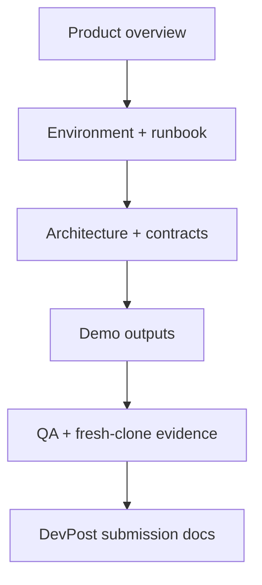

# 📚 PPTX Generator Documentation

**A visual map for users, reviewers, contributors, and DevPost judges**

[Project README](../README.md) · [Run the demo](devpost/PHASE_07_DEMO_RUNBOOK.md) · [Final evidence](devpost/evidence/phase7_final/) · [Submission hub](devpost/submission/README.md)

---

## 🧭 Choose your path

<table>
<tr>
<td width="25%"><b>🚀 I want to run it</b> <a href="devpost/PHASE_07_DEPENDENCY_AND_RUNTIME_GUIDE.md">Environment guide</a> <a href="devpost/PHASE_07_DEMO_RUNBOOK.md">Demo runbook</a></td>
<td width="25%"><b>🧩 I want to understand it</b> <a href="devpost/submission/ARCHITECTURE_OVERVIEW.md">Architecture overview</a> <a href="devpost/submission/EXISTING_ADAPTED_NEW.md">Existing / adapted / new</a></td>
<td width="25%"><b>✅ I want to verify it</b> <a href="devpost/submission/TECHNICAL_METRICS.md">Technical metrics</a> <a href="devpost/evidence/phase7_final/final_release_gate.json">Final release gate</a></td>
<td width="25%"><b>🏁 I want to submit it</b> <a href="devpost/submission/README.md">Submission hub</a> <a href="devpost/submission/DEVPOST_FORM_PAYLOAD.md">Form payload</a></td>
</tr>
</table>

---

## 📑 Documentation layers

| Layer | Audience | Purpose | Editing policy |
|---|---|---|---|
| Public overview | users and judges | explain value, scope, and status | visually curated |
| Runbooks | operators | reproduce the certified workflow | concise and command-focused |
| Architecture | technical reviewers | explain ownership and data flow | diagrams + decision tables |
| Submission | DevPost submitter | copy-ready content and media map | public-facing and evidence-backed |
| Final evidence | auditors | machine-readable proof | **do not restyle or rewrite** |
| Historical phase reports | maintainers | preserve implementation provenance | append-only / immutable where hash-bound |

> **Important:** machine-readable evidence and hash-bound reports should remain byte-stable. Visual organization belongs in indexes, public guides, summaries, and navigation—not inside immutable proof artifacts.

---

## 🗺️ System map

---

## 📌 Public status

| Item | State |
|---|---|
| GitHub repository | Published |
| Default branch | `main` |
| Technical release | `ELIGIBLE_FOR_DEVPOST_SUBMISSION` |
| Tag / GitHub Release | Not created |
| DevPost submission | Not yet submitted |
