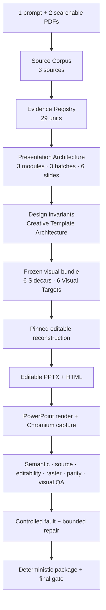

# 🧩 Architecture Overview

> [Submission hub](README.md) · [Documentation hub](../../README.md) · [Project README](../../../README.md) · [Final evidence](../evidence/phase7_final/)

> PPTX Generator is the public product. `DeckCompiler` is its contract-driven Python pipeline.

---

## End-to-end pipeline

---

## Authority map

| Layer | Owns | Must not do |
|---|---|---|
| Source / Evidence | facts, locators, source bindings | invent undocumented facts |
| Presentation Architecture | narrative order, modules, batches, slide roles | rewrite source meaning |
| Semantic Sidecar | canonical text/data and editability requirements | defer semantics to image pixels |
| Visual Target | composition and art direction | become full-slide final output |
| Reconstructor | native PPTX/HTML objects | silently choose another story |
| QA | independent acceptance verdict | trust producer self-report alone |

---

## Key boundaries

- Real slide copy is editable PowerPoint and HTML text, not OCR output.
- The native table, cards, panels, dividers, captions, and frames remain editable or vector-based where required.
- Original Phase 4 Image Generation is provenance-recorded, but the release CLI performs no live Image Generation.
- The external `CAPTW/pngtopptx` four-SkillSet is auto-installed when missing, pinned, orchestrated, and kept outside the repository.
- DeckCompiler owns the exact `sys.executable` and 38-distribution package closure used by external Python scripts.
- JSON Schemas, content hashes, structural fingerprints, real renderers, and a clean-tree final gate make failures reviewable.

---

## Certified P0 boundary

| Proven | Not claimed |
|---|---|
| one six-slide source-controlled workflow | arbitrary document volume |
| one prompt + exactly two searchable PDFs | scanned-PDF OCR |
| Windows x64 prepared-machine profile | arbitrary cross-platform fidelity |
| editable PPTX + companion HTML | Google Slides fidelity |
| frozen visual bundle | live Image Generation in the release CLI |
