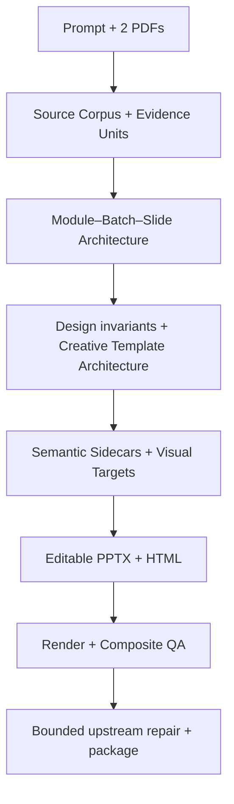

# 🧠 About the Project

> [Submission hub](README.md) · [Documentation hub](../../README.md) · [Project README](../../../README.md) · [Final evidence](../evidence/phase7_final/)

---

## 💡 Inspiration and problem

Many document-to-slide workflows optimize for appearance and quietly flatten the result into screenshots. That makes the final deck difficult to edit and separates claims from their sources.

We wanted four things in one workflow:

| Goal | Why it matters |
|---|---|
| Creative planning | avoid generic template filling |
| Native PowerPoint editability | let users revise real objects after generation |
| Evidence linkage | keep claims traceable to source documents |
| Reproducible proof | show that the workflow works outside the original development environment |

---

## 🧭 Product approach

PPTX Generator accepts a prompt and local source documents, converts them into structured evidence and a presentation plan, and emits an editable PowerPoint deck plus a companion HTML presentation.

**Canonical P0 scope**

- one prompt;
- exactly two text-searchable PDFs;
- three sources;
- 29 Evidence Units;
- one six-slide deck.

**Verified output**

- 131 editable text objects;
- one native table;
- zero picture objects;
- zero full-slide raster violations.

---

## 🧩 Architecture

`DeckCompiler` is the internal deterministic Python pipeline. Versioned JSON Schema contracts connect Source Corpus and Evidence Units, Presentation Architecture, design invariants, Semantic Sidecars, Visual Targets, slot binding, editable reconstruction, Composite QA, repair, and release packaging.

### Image Generation boundary

The original platform-managed Phase 4 workflow executed Image Generation and recorded provenance plus selected-image hashes. The exact image-model identity was not exposed and is not claimed.

The release CLI:

- validates and consumes the frozen bundle;
- performs no live Image Generation;
- needs no API key;
- reconstructs fresh editable PPTX and HTML outputs.

### External reconstruction boundary

The external `CAPTW/pngtopptx` four-SkillSet was not created during Build Week.
PPTX Generator's setup wrapper installs a verified upstream snapshot when it is
missing, then pins and orchestrates it through a verified handoff and release
contract. DeckCompiler owns the exact interpreter and hash-locked package
closure; external Skill source remains outside the repository and delivery ZIP.

---

## 🛠️ Technical challenges

### 1. Dependency ownership followed the interpreter

`pip check` passed, but an external script launched with DeckCompiler's interpreter imported NumPy while NumPy was absent from the release lock.

The fix was not a manual install. We audited the full external execution graph and added:

- a versioned dependency manifest;
- 38 exact hash-bearing distributions;
- isolated import preflight;
- six entrypoint canaries.

### 2. Checkout-independent structural evidence

A legacy structural hash contained an absolute checkout locator. Canonicalizing it to a filename made the evidence checkout-independent without changing presentation content.

### 3. Repair without patching final bytes

A controlled off-canvas fault was rejected. A bounded repair restored the upstream owner in one wave, and immutable before/faulty/repaired evidence confirms that the final PPTX was not patched directly.

---

## 📈 Reproducibility and results

| Result | Evidence |
|---|---:|
| Full demo runs | 4 |
| Stages per run | 36 / 36 PASS |
| Historical Phase 7 focused tests | 274 PASS |
| Historical Phase 7 full suite | 733 PASS |
| Current public minimal-snapshot suite | 490 PASS |
| PowerPoint renders | 6 / 6 |
| Chromium captures | 6 / 6 |
| Final release gates | 81 / 81 PASS |
| Unexplained divergence | 0 |

The 274/733 results belong to the immutable historical Phase 7 full-workspace
evidence. The bounded test inventory distributed in the public snapshot is the
separately verified 490-test suite.

### Certified environment

| Component | Certified value |
|---|---|
| CPython | 3.11.9 AMD64 |
| Node.js / npm | 24.13.1 / 11.11.0 |
| PowerPoint | 16.0 build 20131 x64 |
| Playwright | 1.61.0 |
| Chromium | revision 1228 |
| Chrome for Testing | 149.0.7827.55 |

A later prerequisite recheck observed Node.js 24.14.0 and PowerPoint build 20228; those later values are not the certified canonical-run environment.

---

## 🧱 Existing, adapted, and new

| Classification | Examples |
|---|---|
| Build Week new | evidence contracts, multi-source intake, Architecture integration, Sidecars, Composite QA, controlled repair, dependency closure, one-command demo, packaging, fresh-clone proof |
| Adapted existing | ingestion, workflow planning, creative planning, editable-template concepts, QA concepts, local runtime utilities |
| External existing | `CAPTW/pngtopptx`, PowerPoint, Chromium, Node.js, public Python dependencies |

---

## 🎓 What we learned

1. Dependency ownership follows the interpreter, not only the repository containing a script.
2. A passing resolver does not prove direct imports are closed.
3. Reliable editable-slide generation needs semantic contracts and real renderers.
4. Acceptance authority must be independent from the producer.
5. Repair should change the upstream owner, not patch final bytes.

---

## ⚠️ Limitations and status

- one source-controlled six-slide P0;
- no arbitrary-volume document ingestion;
- no scanned or image-only PDF OCR;
- Windows x64 prepared-machine profile;
- no Google Slides fidelity;
- no arbitrary PNG-to-perfect-PPTX conversion;
- no arbitrary cross-platform PowerPoint claim;
- no unexposed model identity claim;
- no live Image Generation rerun in the release CLI.

**Technical status:** `ELIGIBLE_FOR_DEVPOST_SUBMISSION` 
**GitHub:** published 
**DevPost:** not yet submitted
