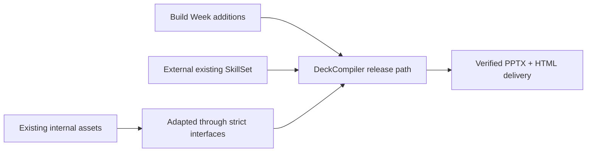

# 🧱 Existing, Adapted, and Build Week New

> [Submission hub](README.md) · [Documentation hub](../../README.md) · [Project README](../../../README.md) · [Final evidence](../evidence/phase7_final/)

---

## Ownership map

| Classification | What belongs here |
|---|---|
| **Build Week new** | Source Corpus and Evidence Unit contracts, multi-source intake, Presentation Architecture integration, Module–Batch–Slide planning, design invariants, Semantic Sidecars, visual orchestration, Composite QA, controlled repair, dependency closure, one-command demo, packaging, fresh-clone evidence |
| **Adapted existing** | source ingestion, workflow planner, Creative Front-End planning, editable-template concepts, QA concepts, local runtime utilities |
| **External existing** | `CAPTW/pngtopptx` four-SkillSet, PowerPoint, Chromium, Node.js, Python dependencies |
| **Removed legacy surface** | a superseded repo-local duplicate Skill surface, removed after contract detachment and quarantine |

---

## External canonical SkillSet

- `slide-editable-deck-orchestrator`
- `slide-text-layer-inpaint`
- `slide-image-dual-render`
- `slide-visual-polish-qa`

The four-SkillSet was **not** created during Build Week. The setup wrapper
installs its verified upstream snapshot when missing. It is pinned by a 99-file
installation aggregate, remains outside this repository, and is not packaged
into the delivery ZIP.

> “The duplicate repo-local surface was removed” does **not** mean PNGtoPPTX or the external canonical SkillSet was removed.
