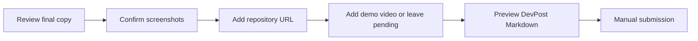

# 🏁 DevPost Submission Hub

**Copy-ready narrative, verified metrics, media order, and submission controls**

[Project README](../../../README.md) · [Documentation hub](../../README.md) · [Final evidence](../evidence/phase7_final/)

---

## Current state

| Area | Status |
|---|---|
| Technical release | ✅ `ELIGIBLE_FOR_DEVPOST_SUBMISSION` |
| GitHub repository | ✅ Published: [`CAPTW/PPTXGenerator`](https://github.com/CAPTW/PPTXGenerator) |
| Default branch | ✅ `main` |
| Git tag | ⏳ Not created |
| GitHub Release | ⏳ Not created |
| DevPost submission | ⏳ Not yet submitted |
| Codex Session ID | `PENDING_USER_FEEDBACK` |

---

## 📋 Submission workflow

---

## Start here

| Need | Document |
|---|---|
| One-paragraph overview | [PROJECT_SUMMARY.md](PROJECT_SUMMARY.md) |
| One-sentence pitch | [ELEVATOR_PITCH.md](ELEVATOR_PITCH.md) |
| Full About narrative | [DEVPOST_ABOUT_PROJECT.md](DEVPOST_ABOUT_PROJECT.md) |
| Copy-ready form fields | [DEVPOST_FORM_PAYLOAD.md](DEVPOST_FORM_PAYLOAD.md) |
| Built With tags | [BUILT_WITH_TAGS.md](BUILT_WITH_TAGS.md) |
| Demo recording flow | [DEMO_SCRIPT.md](DEMO_SCRIPT.md) |

## Verify the claims

| Need | Document |
|---|---|
| Architecture | [ARCHITECTURE_OVERVIEW.md](ARCHITECTURE_OVERVIEW.md) |
| Technical metrics | [TECHNICAL_METRICS.md](TECHNICAL_METRICS.md) |
| Judging evidence | [JUDGING_EVIDENCE_MATRIX.md](JUDGING_EVIDENCE_MATRIX.md) |
| Existing / adapted / new | [EXISTING_ADAPTED_NEW.md](EXISTING_ADAPTED_NEW.md) |
| Screenshots and assets | [SCREENSHOT_AND_ARTIFACT_INDEX.md](SCREENSHOT_AND_ARTIFACT_INDEX.md) |
| Known limitations | [KNOWN_LIMITATIONS.md](KNOWN_LIMITATIONS.md) |
| Session provenance | [SESSION_PROVENANCE.md](SESSION_PROVENANCE.md) |

## Finish the submission

| Need | Document |
|---|---|
| Submission controls | [SUBMISSION_CHECKLIST.md](SUBMISSION_CHECKLIST.md) |
| Human sign-off | [FINAL_HUMAN_REVIEW_CHECKLIST.md](FINAL_HUMAN_REVIEW_CHECKLIST.md) |
| GitHub publication record | [GITHUB_PUBLICATION_PLAN.md](GITHUB_PUBLICATION_PLAN.md) |

---

## Evidence authority

The public narrative is supported by:

- [Final release gate](../evidence/phase7_final/final_release_gate.json)
- [Canonical delivery ZIP](../evidence/phase7_final/pptx_generator_devpost_delivery.zip)
- [Semantic reproducibility report](../evidence/phase7_final/phase7c_reproducibility_report.json)
- [Corrected acceptance and package-validation gate](../evidence/phase7_final/phase7c_corrected_acceptance.json)
